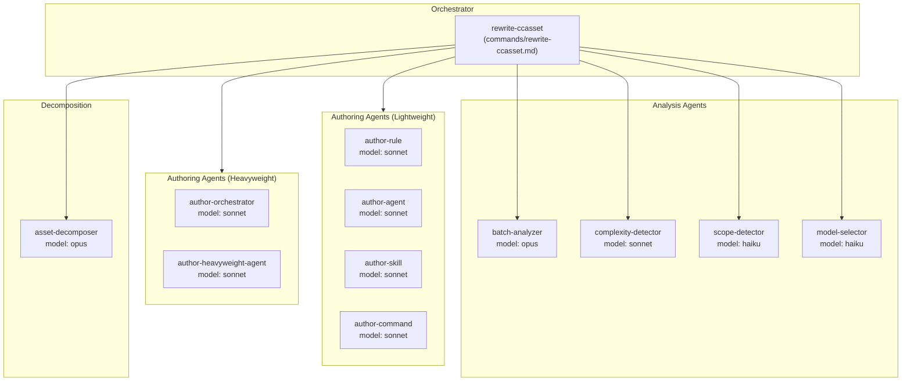
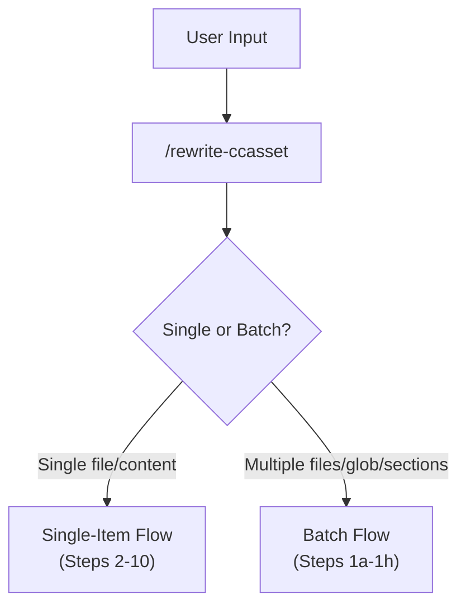
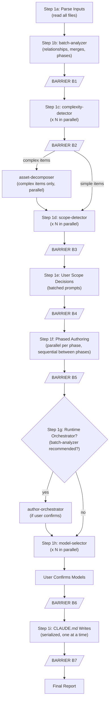
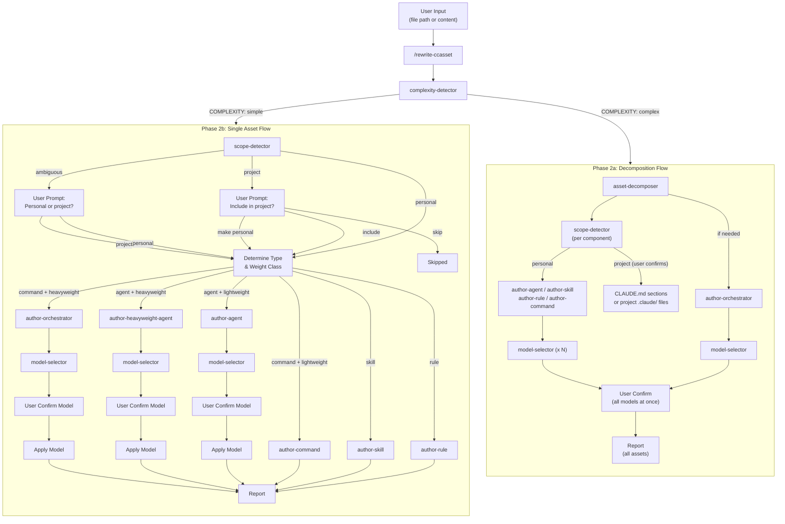
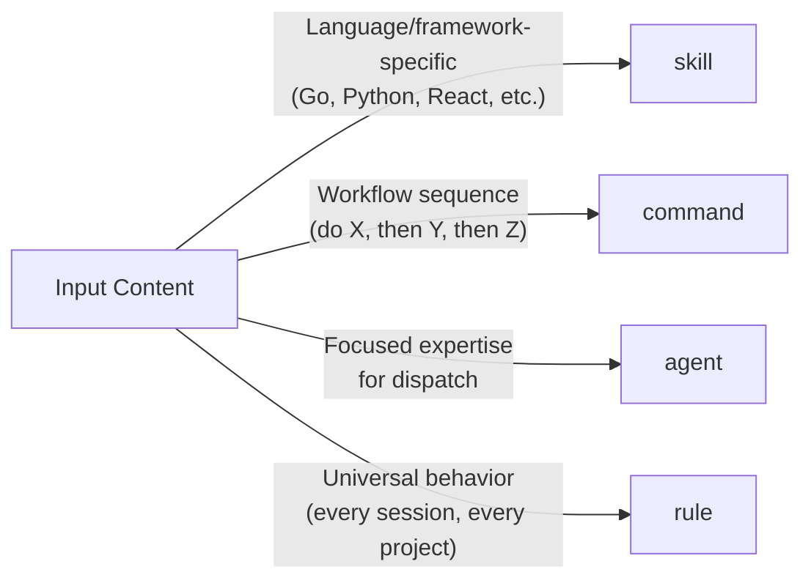
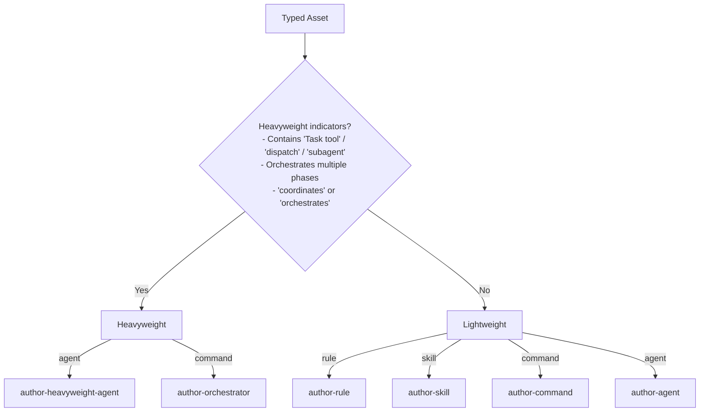
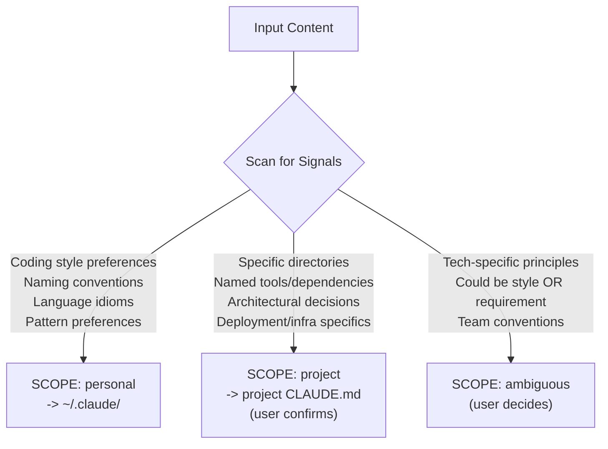
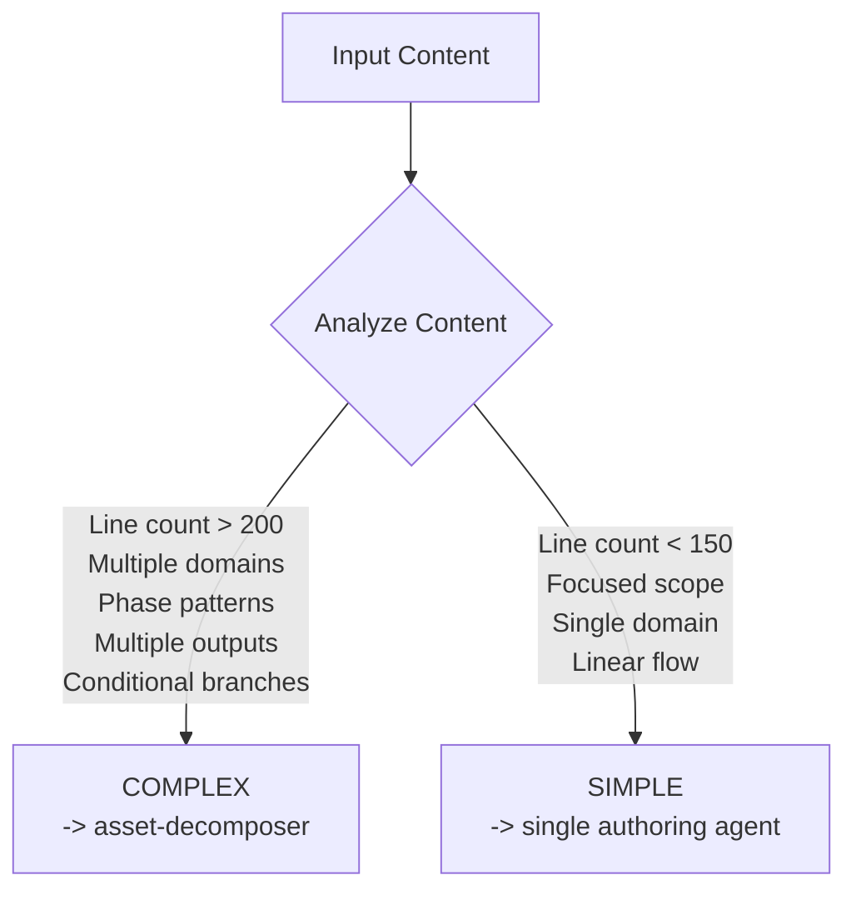
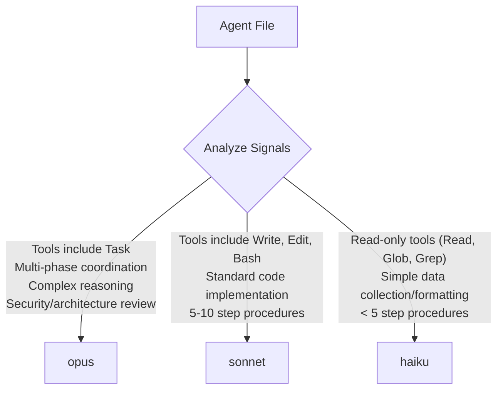
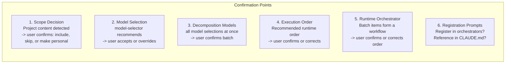

# Claude Asset Writer Architecture

## Overview

The Claude Asset Writer is a system for authoring Claude Code assets (rules, agents, skills, commands) according to established standards. It handles complexity detection, scope classification (personal vs project), decomposition of large inputs, type and weight classification, model selection, batch processing with parallel execution, and user confirmation flows.

## System Components



---

## Data Flow

### Input Detection



### Batch Pipeline



### Single-Item Full Pipeline



---

## Classification Logic

### Asset Type Detection



### Weight Class Detection



### Scope Detection



#### Project Destination Routing

| Asset Type | Project Destination | Format |
|---|---|---|
| rule | `<project>/CLAUDE.md` | Inline section |
| skill | `<project>/CLAUDE.md` | Inline section |
| agent | `<project>/.claude/agents/` | Separate file |
| command | `<project>/.claude/commands/` | Separate file |

### Complexity Detection



---

## Model Selection Logic

The `model-selector` agent analyzes written agent files and recommends a model:



---

## File Size Guidelines

| Asset Type | Target Lines |
|---|---|
| Rules | < 50 |
| Lightweight agents | ~80 |
| Heavyweight agents | 100-150 |
| Skills | ~100 (main SKILL.md) |
| Lightweight commands | ~80 |
| Orchestrator commands | 100-150 |

---

## User Interaction Points



**Note:** Personal content flows through without prompting. Only project-scoped and ambiguous content triggers scope confirmation.

---

## Batch Processing

### Synchronization Barriers

The batch flow uses 7 explicit barriers to ensure correct execution order:

| Barrier | After | Before | Purpose |
|---|---|---|---|
| B1 | Batch analysis | Complexity detection | Need merge/phase plan and runtime coordination assessment |
| B2 | All complexity detections | Scope detection | Need to know which items expand |
| B3 | All scope detections | User scope prompts | Need all scopes to batch prompts |
| B4 | User scope decisions | Authoring | Need to know what to write and where |
| B5 | All authoring (all phases) | Runtime orchestrator | Need written files before coordinating them |
| B6 | All model selections | CLAUDE.md writes | Need user model confirmation first |
| B7 | All CLAUDE.md writes | Final report | Everything must be written |

### Parallel Execution Model

The Task tool blocks until the subagent returns. "Parallel" means dispatching multiple Task calls in a single orchestrator message — Claude Code processes these concurrently. The orchestrator waits for all to return before proceeding past a barrier.

### CLAUDE.md Write Serialization

Multiple project-scoped writes to the same CLAUDE.md file are always serialized (one at a time) to prevent race conditions. Each write reads the current file state, checks for conflicts, and appends.

### Error Handling

When a parallel dispatch fails: retry once. If retry fails: mark as failed, continue with remaining items. One failed item never blocks the batch. All failures are reported in the final report.

---

## Execution Order Analysis

### Where It Happens

Execution order analysis occurs in two places:

| Context | Agent | When | Purpose |
|---|---|---|---|
| Decomposition | `asset-decomposer` (Step 5b) | After agents created, before orchestrator authored | Determine runtime order for the orchestrator's dispatch flow |
| Batch processing | `batch-analyzer` (Step 5) | During initial batch analysis | Detect if batch items form a runtime workflow needing coordination |

### Data Flow Signals

| Signal | Meaning |
|---|---|
| B's purpose references A's output | A before B (sequential dependency) |
| A and B both analyze the same input independently | A and B can run in parallel |
| C consolidates or reports on A and B | C runs after both (fan-in) |
| D only runs if A finds something specific | D conditional on A |

### Output

Both contexts produce a phased execution order:

```
Phase 1 (parallel): [agent1], [agent2]
Phase 2: [agent3] (needs output from phase 1)
Conditional: [agent4] (only if agent1 finds issues)
```

This order is confirmed by the user before being passed to `author-orchestrator`.

---

## Extension Points

### Adding New Asset Types

1. Create `author-<type>.md` in `agents/`
2. Add type detection logic to `rewrite-ccasset.md` Step 3
3. Add routing in Step 4

### Adding New Complexity Patterns

1. Update `complexity-detector.md` with new indicators
2. Update `asset-decomposer.md` if new decomposition logic needed

### Adding New Model Selection Signals

1. Update `model-selector.md` with new criteria

### Adding New Scope Signals

1. Update `scope-detector.md` signal taxonomy with new personal/project/ambiguous indicators

### Adding New Project Destinations

1. Update `rewrite-ccasset.md` Step 5a for new inline formatting patterns
2. Update `asset-decomposer.md` Step 4 for new project file routing
