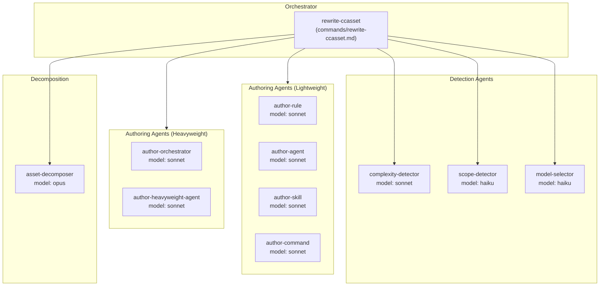
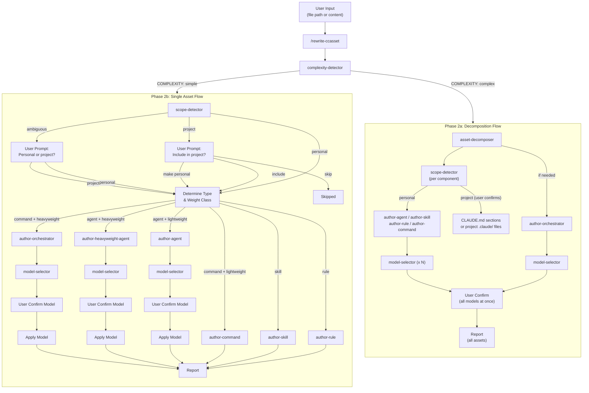
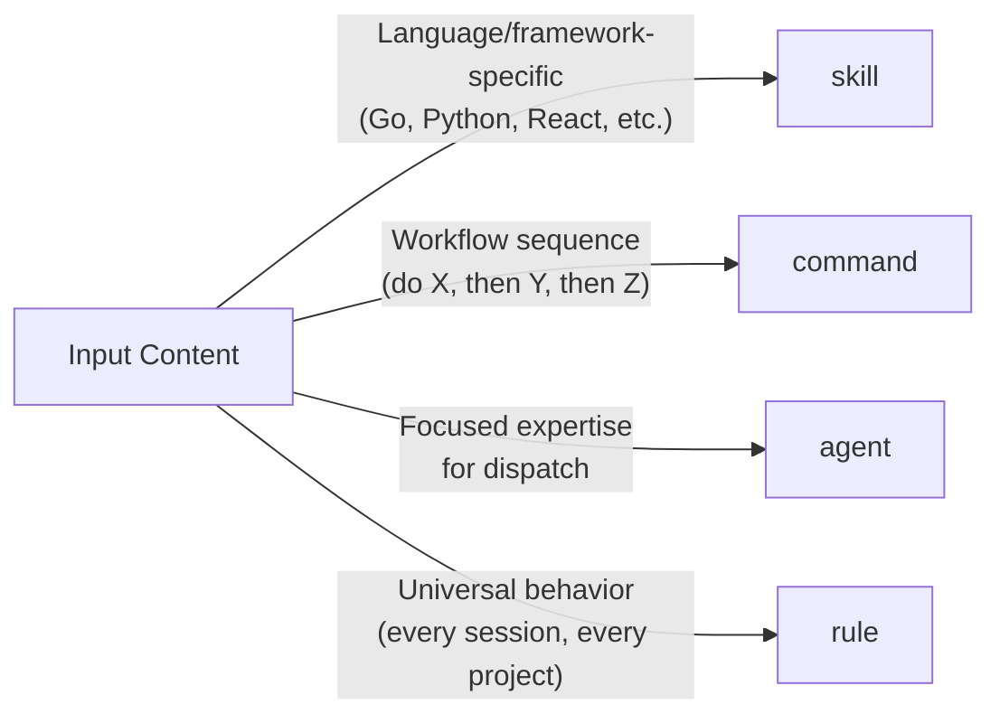
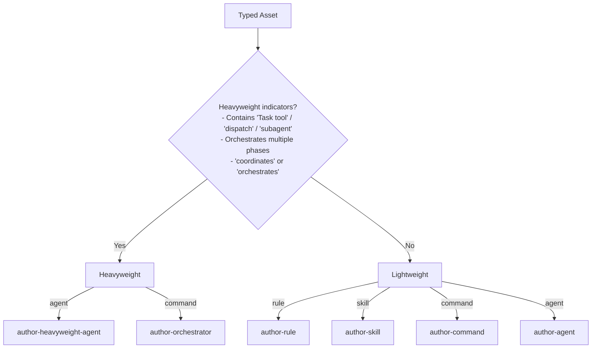
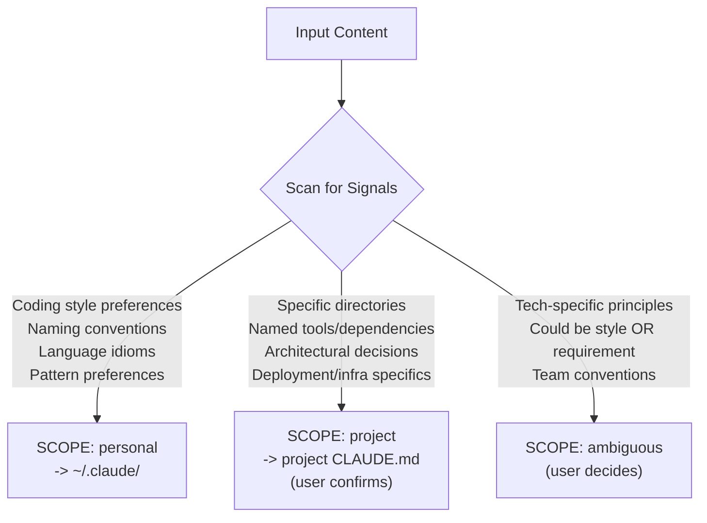
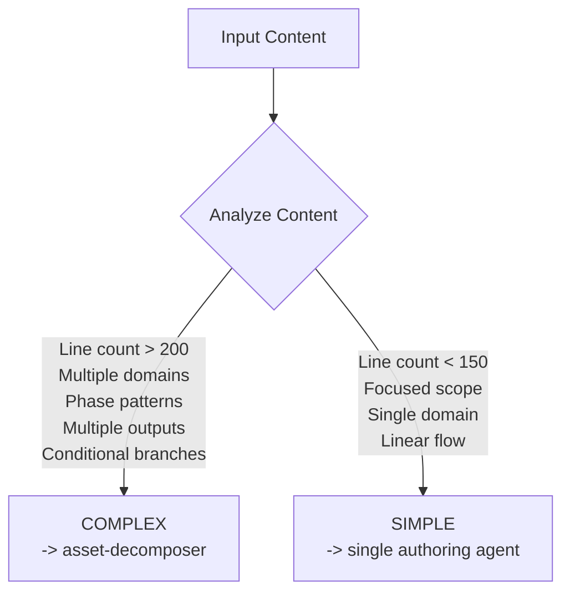
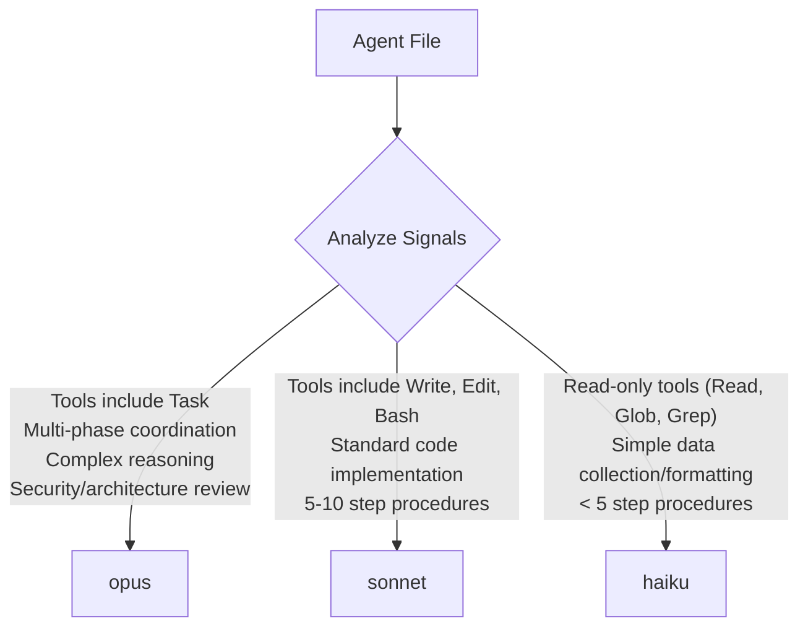
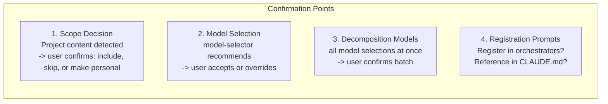

# Claude Asset Writer Architecture

## Overview

The Claude Asset Writer is a system for authoring Claude Code assets (rules, agents, skills, commands) according to established standards. It handles complexity detection, scope classification (personal vs project), decomposition of large inputs, type and weight classification, model selection, and user confirmation flows.

## System Components

---

## Data Flow

### Full Pipeline

---

## Classification Logic

### Asset Type Detection

### Weight Class Detection

### Scope Detection

#### Project Destination Routing

| Asset Type | Project Destination | Format |
|---|---|---|
| rule | `<project>/CLAUDE.md` | Inline section |
| skill | `<project>/CLAUDE.md` | Inline section |
| agent | `<project>/.claude/agents/` | Separate file |
| command | `<project>/.claude/commands/` | Separate file |

### Complexity Detection

---

## Model Selection Logic

The `model-selector` agent analyzes written agent files and recommends a model:

---

## File Size Guidelines

| Asset Type | Target Lines |
|---|---|
| Rules | < 50 |
| Lightweight agents | ~80 |
| Heavyweight agents | 100-150 |
| Skills | ~100 (main SKILL.md) |
| Lightweight commands | ~80 |
| Orchestrator commands | 100-150 |

---

## User Interaction Points

**Note:** Personal content flows through without prompting. Only project-scoped and ambiguous content triggers scope confirmation.

---

## Extension Points

### Adding New Asset Types

1. Create `author-<type>.md` in `agents/`
2. Add type detection logic to `rewrite-ccasset.md` Step 3
3. Add routing in Step 4

### Adding New Complexity Patterns

1. Update `complexity-detector.md` with new indicators
2. Update `asset-decomposer.md` if new decomposition logic needed

### Adding New Model Selection Signals

1. Update `model-selector.md` with new criteria

### Adding New Scope Signals

1. Update `scope-detector.md` signal taxonomy with new personal/project/ambiguous indicators

### Adding New Project Destinations

1. Update `rewrite-ccasset.md` Step 5a for new inline formatting patterns
2. Update `asset-decomposer.md` Step 4 for new project file routing
